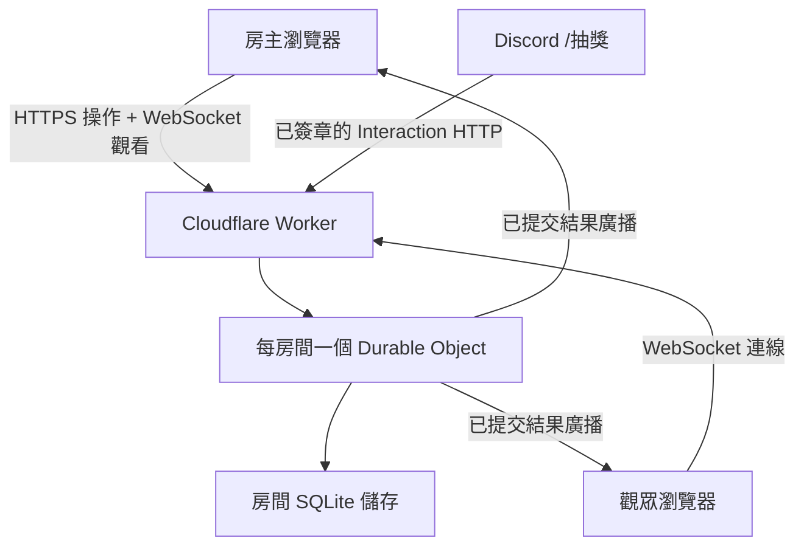

# Artale-Tools 線上同步抽獎：Codex 實作規格

日期：2026-10-01（台灣時間）

## 1. 可直接交給 Codex 的任務

請將現有 https://artaletools.github.io/Artale-Tools/ 的抽獎功能擴充為線上房間：房主按下抽獎，同房間所有觀看者自動看到相同結果。前端保留 GitHub Pages，後端採 Cloudflare Workers + SQLite-backed Durable Objects + WebSocket Hibernation，優先使用免費方案。抽獎結果必須由後端產生、保存成功後才公布。

先閱讀專案抽獎程式及現有部署設定再實作。後端檔案名稱與 API 皆為待建立的設計，不代表現有網站已具備這些功能。

### 1.1 現有原始碼查核結果（2026-10-01，commit `b6ee270`）

| 項目 | 實際狀況 |
| --- | --- |
| 專案結構 | repo 只有單一 `index.html`（內嵌 CSS/JS），沒有 AGENTS.md、README、package.json、建置流程或框架 |
| 部署 | GitHub Pages 直接發布 `main` 分支根目錄，base path 為 `/Artale-Tools/` |
| 設定欄位 | 範圍(小) 預設 1、範圍(大) 預設 50、抽取數量預設 1；`+/-` 按鈕不讓 min 低於 0、qty 低於 1（直接輸入則無此限制） |
| 驗證 | `vMin >= vMax`、`n <= 0`、`n > vMax - vMin + 1` 皆視為「設定錯誤」；**min 必須小於 max，不接受單值區間** |
| 重複規則 | **只有不重複模式**（整池 Fisher–Yates 後取前 n 個），沒有「允許重複」選項 |
| 結果顯示 | 中獎號碼**由小到大排序**後以「、」串接 |
| 產生結果的函式 | `startDraw()`：先用 `Math.random()` 決定結果，再跑 `roll()` 動畫 |
| 動畫 | `roll()` 共 50 次跳號（前 35 次每 50ms，之後每次 +20ms，總長約 4.5 秒）；第 25 次後卡片 `shake`；結束顯示「恭喜中獎！」＋ `lucky-text` 閃光字、`fireConfetti()` 彩帶、Web Audio 音效 |
| 音效 | 頁面載入時就建立 `AudioContext`；瀏覽器自動播放政策下，觀眾沒有點擊頁面前不會出聲 |
| 呈現方式 | 以 `innerHTML` 插入數字；線上模式必須先驗證伺服器回傳為整數，或改用 `textContent` |

因為沒有建置流程，「既有建置環境變數」不存在；公開設定改放獨立的 `config.js`（見第 9 節）。

保留現有功能與風格；保留本機抽獎，另提供線上房間入口。完成可執行程式、設定範例、必要測試與部署說明。缺少 Cloudflare 登入或正式 API 網址時先完成本機版與測試，明確列出部署缺口。不要把 API 金鑰寫入前端、提交秘密、擅自升級付費方案或購買網域。

## 2. 第一版範圍

| 功能 | 要求 |
| --- | --- |
| 建立房間 | 產生無法輕易猜測的 roomId 與房主權杖 |
| 分享 | 分享觀看網址，點開即可觀看，不必註冊 |
| 房主操作 | 設定上下限、抽取數量、啟動抽獎、關閉房間 |
| 同步 | 透過 WebSocket 發送已保存的正式結果 |
| 新觀眾 | 立即取得目前設定、最新結果、最近紀錄 |
| 重整與斷線 | 重連後補同步，不能自行產生新結果 |
| 歷史紀錄 | 顯示編號、時間、設定、結果，最多保留 100 次 |
| 權限 | 觀眾唯讀；後端驗證房主操作 |
| 成本 | 免費方案優先；限制連線、房間存活時間及頻率 |

| Discord 觸發 | 指定 Discord 頻道輸入 `/抽獎` 由後端抽獎，Discord 訊息顯示跳號動畫與結果，同時廣播到網頁房間播放原動畫（見第 16 節） |

「大家看得到」定義為持有同一房間連結的人。第一版不做所有房間的全球公開看板。暫不加入帳號系統、聊天、付款、全站搜尋與集中統計。

## 3. 架構與資料流



GitHub Pages 只提供 HTML、CSS、JavaScript。Worker 負責路由、輸入限制與 Origin 檢查；使用 `idFromName(roomId)` 對應固定 Durable Object。房主除了 HTTPS 操作外也要連 WebSocket，才能收到自己以外來源（例如 Discord）的結果。Durable Object 的內部路由不可由外部路徑直接轉送。該物件負責房間權限、排序、抽獎、資料持久化與廣播。

不要只在普通 Worker 的全域 Map 保存房間或 WebSocket：不同請求可能落在不同實例，重啟會遺失資料。第一版使用房間 Durable Object 自帶 SQLite 即可，不必另外建立 D1，避免兩個資料庫之間的提交與同步問題。日後需要跨房間搜尋、長期報表，再評估 D1。

### 建立與加入

1. 房主按「建立線上房間」。前端送 POST /api/rooms。
2. Worker 產生至少 128 位元隨機 roomId；後端產生至少 256 位元 hostToken。
3. 房間寫入 token 的 SHA-256 雜湊、建立時間、到期時間與初始狀態。
4. 僅建立回應包含原始 hostToken；之後公開狀態、WebSocket、歷史不得包含。
5. 前端在該瀏覽器保存 hostToken，用 Authorization: Bearer 提交房主操作。採 localStorage 時明確處理 XSS，並在房間關閉、到期或收到 404／410 時清除（本產品沒有登入／登出）；不要放進分享連結。
6. 分享網址使用現有 GitHub Pages 路徑，例如 https://artaletools.github.io/Artale-Tools/?room=<roomId>。
7. 觀眾開啟連結後連接 `wss://<worker-host>/api/rooms/<roomId>/ws`，後端立刻發送 snapshot。`<worker-host>` 僅是佔位符；正式設定須使用實際部署取得的 `workers.dev` 主機名稱。

### 抽獎

1. 房主填寫設定並按抽獎；前端生成 requestId，鎖住按鈕。
2. POST /api/rooms/<roomId>/draw，帶 token、requestId、expectedVersion 與設定。
3. 後端驗證 token、房間狀態、到期時間、速率與設定。
4. 在同一房間中序列化修改操作，處理 requestId 冪等，再檢查版本。
5. 後端用 crypto.getRandomValues 產生結果。
6. 在同一 SQLite transaction 保存結果、requestId、sequence 與房間版本；提交完成後才回覆與廣播。
7. 觀眾按 sequence 去重顯示。動畫只做呈現，最終數字只能使用後端結果；房主端也必須等後端回應後才停在結果，不能像原本 `startDraw()` 一樣先在本機決定。
8. 回應逾時時用相同 requestId、相同內容重試。不得生成新 requestId 自動再抽。

## 4. API 契約

API 採 /api 前綴；回應 JSON 包含 schemaVersion: 1。時間儲存 UTC ISO 8601，畫面轉台灣時間。

| 方法 | 路徑 | 權限與用途 |
| --- | --- | --- |
| POST | /api/rooms | 建立房間；開啟濫用防護 |
| GET | /api/rooms/:roomId | 公開 snapshot；無秘密欄位 |
| GET | /api/rooms/:roomId/ws | 帶 `Upgrade: websocket` 的 WebSocket 握手；成功時回 101 並開始觀看，不是一般 JSON 查詢 |
| POST | /api/rooms/:roomId/draw | 房主；後端抽獎 |
| POST | /api/rooms/:roomId/close | 房主；關閉並廣播 |
| GET | /api/health | 輕量健康檢查，不查所有房間 |
| POST | /discord/interactions | Discord Interactions Endpoint；只接受 Ed25519 簽章正確的請求（第 16 節） |

建立回應示例：

```json
{"schemaVersion":1,"roomId":"<random-id>","hostToken":"<secret-returned-once>","version":0,"expiresAt":"2026-10-02T00:00:00Z"}
```

抽獎 request 示例：

```json
{"requestId":"<uuid>","expectedVersion":0,"min":1,"max":100,"count":3}
```

正式結果示例：

```json
{"schemaVersion":1,"type":"draw_committed","roomId":"<id>","version":1,"draw":{"id":"<uuid>","sequence":1,"requestId":"<uuid>","source":"web","min":1,"max":100,"count":3,"results":[17,42,83],"createdAt":"2026-10-01T00:10:00Z"}}
```

錯誤格式：

```json
{"error":{"code":"VERSION_CONFLICT","message":"房間狀態已更新，請重新同步。"}}
```

狀態碼：400 無效輸入、401 token 錯誤、404 不存在、409 版本或冪等內容衝突、410 關閉／過期、413 過大、429 限流、503 平台額度或服務不可用。不得向前端傳堆疊、秘密或完整內部錯誤。

## 5. 持久化與一致性

建議在每個物件內設立 room、draws 資料表。

| 資料 | 欄位 |
| --- | --- |
| room | room_id、kind（web／discord）、host_token_hash、status、created_at、expires_at、closed_at、version、last_sequence、current_settings_json、day_key、day_count、last_draw_at |
| draws | id、sequence UNIQUE、request_id UNIQUE、request_hash、source、settings_json、results_json、created_at |

房間初始化必須防重複；SQLite schema 初始化使用官方建議生命週期方式。所有 SQL 使用參數綁定。

同 requestId 與同 payload 的重試返回原結果，即使 expectedVersion 已過期；同 requestId 不同 payload 返回 409。冪等命中的重試不受冷卻時間與每日次數限制（否則 2 秒內的逾時重試會被 429 擋下），也不再次廣播。保留期內的冪等紀錄不能先於對應抽獎紀錄刪除。最新 100 次以外的紀錄不保證可查；過舊版本的新請求必須拒絕，不能重抽。

抽獎操作的冪等檢查、版本比較、序號分配、結果持久化與版本更新必須形成一個明確的原子流程。避免在查詢版本與提交結果之間插入未受保護的 `await`；Durable Object 的單執行緒不代表跨 `await` 自動沒有交錯。以 SQLite transaction 包住所有資料庫狀態變更，並以不讓出控制權的同步區段或明確佇列保護交易前的檢查；不要在 transaction 中執行網路請求或其他外部非同步工作。實作需依當前 Cloudflare API 驗證交易行為。hostToken 雜湊驗證需在權限邊界完成；固定長度雜湊比較盡可能使用常數時間比較。對外錯誤回應避免透露可用於掃描房間的額外資訊。

提交成功、廣播失敗時，資料仍有效；斷線客戶端從 snapshot 恢復。不要因廣播失敗重新抽獎。物件重啟後讀取儲存狀態，而非依賴記憶體。

## 6. 隨機抽獎規則

第一版限制 min/max 為 0 到 1,000,000 的整數（原工具 `+/-` 不允許負數），區間長度（max - min + 1）不超過 100,000；count 介於 1 到 100。為與原工具一致，**min 必須小於 max**。後端應拒絕 NaN、Infinity、小數、字串型數字、min >= max 及超界值。預設值沿用原工具：1、50、1。

第一版只有不重複模式（與原工具一致），count <= max - min + 1，不提供 allowDuplicates 欄位。使用無偏的隨機整數函式配合局部 Fisher–Yates（區間大時用稀疏 Map 交換，避免配置整個陣列）。不可直接對隨機 uint32 取餘數；採 rejection sampling 排除不能整除區間長度的尾端，再取模。

結果依抽取順序保存；UI 沿用原工具由小到大排序顯示，並標示「由小到大顯示」。後端不得接受 results 欄位。伺服器產生結果能防觀眾偽造提交，但不能證明營運者完全無法操控；第一版不宣稱有外部可驗證公平性。保留紀錄只能供核對。

## 7. WebSocket 與斷線處理

使用 Durable Objects WebSocket Hibernation API（acceptWebSocket、getWebSockets 及官方生命週期 handler）。連線必要資訊透過 serializeAttachment / deserializeAttachment 保留，不能只存在普通 Map。空閒時避免常駐 setInterval；必要心跳使用 `setWebSocketAutoResponse(new WebSocketRequestResponsePair("ping","pong"))`，客戶端間隔不短於 30 秒。WebSocket 升級失敗時瀏覽器拿不到 HTTP 狀態碼，因此前端在連線關閉後先 GET snapshot 判斷 404／410／關閉，再決定是否重連。

連線成功先發 snapshot，包含 version、lastSequence、settings、latestDraw、history、status、expiresAt。更新事件依序處理：同或較舊 sequence 忽略；發現跳號則重新取得 snapshot。重新連線後完整補同步，不能只期待收到下一次廣播。

前端重連採帶 jitter 的指數退避，例如 1、2、4、8 秒，最高 30 秒，失敗達上限改為手動重連。房間不存在、關閉、過期或明確額度失敗時停止自動重連。不得每 3 秒永遠輪詢。顯示「連線中／已連線／已斷線／已關閉」，斷線時保留最後結果但標示未同步。

同一事件可能由 POST 回應及 WebSocket 重複送達，使用 draw.id / sequence 去重。房主端也以後端 snapshot 恢復設定。第一版不必實作每毫秒同步的動畫；正常網路下收到結果後立即呈現，測試目標約 1 秒內，不能保證所有網路皆達標。

## 8. 權限與濫用控制

- hostToken 只在房主本機與首次建立回應出現；禁止日誌記錄 Authorization。
- 分享連結可被轉傳，持有者都能觀看；第一版不是私密帳號房間。
- REST CORS 僅允許 https://artaletools.github.io；Origin 不包含 /Artale-Tools/ 路徑。另允許明確的本機開發 Origin，正式環境移除。
- OPTIONS 允許必要方法與 Authorization、Content-Type；錯誤回應也附正確 CORS。CORS 不能代替 token 驗證。
- WebSocket upgrade 必須另驗證 Origin；非瀏覽器可偽造 Origin，因此仍需連線與房間限制。
- 第一版 WebSocket 觀眾唯讀，不透過 URL query 傳房主 token。
- 所有名稱／訊息用 textContent 呈現；不插入未清理的 HTML。原工具以 `innerHTML` 插入號碼，線上模式要改寫。
- Worker 限制 body <= 8 KiB。拒絕不允許的方法與額外 results 欄位。
- 預設每房間最多 100 條同時 WebSocket 連線、同房間抽獎至少間隔 2 秒、每房間每 UTC 日最多 500 次成功抽獎、房間存活 24 小時。UTC 日以 00:00 UTC 重置；被冪等重試命中的已完成請求不重複計次；遭拒請求不計次。這些是產品預設，不是平台額度。超過連線上限時，在 WebSocket upgrade 前回 `429` JSON 錯誤並附 `Retry-After`（若適用）；連線成功後不得超額接受。
- 針對建立房間與連線升級，在進入房間物件前做 IP／平台層限流；使用 Workers Rate Limiting binding（wrangler `ratelimits`，period 只能 10 或 60 秒），它是各據點近似計數，不是精確全域限制。記憶體計數不是全站硬限制，需在 README 說明其效力。
- 公開建立房間使用 Turnstile，且由 Worker 後端驗證一次性 token。正式環境若缺少 Turnstile secret 或驗證服務不可用，建立房間應 fail closed（回 `503`），不可默默略過驗證。僅本機開發可用明確的 `ENVIRONMENT=development` 測試模式略過；測試模式不可部署到正式環境。
- 不建立可讓任何使用者不停掃描的公開房間清單。

房間設定 alarm 在到期後將狀態設為 expired、關閉連線並清理房間資料；alarm 失敗需可重試。不要每分鐘掃描所有房間。已過期物件被新請求喚醒時也必須檢查過期狀態，不得重新建立。清理時**不可用 `deleteAll()` 清空整個物件**：否則物件與「從未建立」無法區分，只能回 404 而非 410，也擋不住同 roomId 被重新初始化。應刪除 draws 與 token 雜湊，但保留只含 room_id／status=expired 的 tombstone 列。明確區分手動 close 與 TTL 到期：close 立即禁止修改、廣播 `room_closed` 並關閉連線（token 雜湊暫留，僅用來讓重複 close 回傳成功，不再授權任何修改）；保留唯讀結果與歷史 7 天（自 close 起算，alarm 改排到 closed_at + 7 天），重複 close 回傳成功且不增加版本。到期後回 `410` 並停止重連；到期清理後再次存取仍回 `410`，不得建立同 roomId 的新房間。Discord 頻道房間（第 16 節）不套用 24 小時 TTL，只保留最近 100 筆。冪等重試僅在房間仍開啟時可重放；關閉後不允許抽獎重試。

## 9. 前端修改要求

先找出目前真正產生結果的函式與動畫流程。本機模式沿用原有邏輯；線上模式呼叫 API，所有顯示皆用伺服器結果。保留設定欄位、繁體中文、手機版與既有工具入口。

加入「本機抽獎／線上房間」、建立房間、房間編號、複製觀看連結、連線狀態、最新結果與歷史。觀眾隱藏或禁用抽獎控件，但真正權限仍由後端檢查。hostToken 遺失時不能僅靠 roomId 取回房主身份；提示建立新房間。不要新增無驗證的領回房主 API。

觀眾頁面無法在使用者互動前播放音效；線上模式提供「啟用音效」按鈕，並延後建立 `AudioContext`。

API_BASE_URL 放公開設定檔 `config.js`（本專案沒有建置流程），值為實際 Worker origin，例如 `https://<worker-host>`（尖括號是佔位符，部署時必須換成真實主機）；這是公開網址，並非秘密。以 `new URL('/api/...', API_BASE_URL)` 組 API 路徑，將 `https:` 轉為 `wss:` 建 WebSocket URL。API origin 不應拼接 GitHub Pages 的 `/Artale-Tools/` 子路徑；GitHub Pages 分享頁則保留該 base path。API 未設定時顯示「線上功能尚未設定」，不可把本機結果偽裝為已同步。

## 10. 專案交付結構

依現有框架調整，以下是建議而非強制重構：

```text
index.html            （現有，加入線上模式）
config.js             （公開設定：API_BASE_URL、TURNSTILE_SITE_KEY）
backend/
  src/index.ts
  src/room.ts
  src/random.ts
  src/validation.ts
  src/discord.ts
  scripts/register-commands.mjs
  wrangler.jsonc
  package.json
  tests/
docs/
  online-draw-deployment.md
  online-draw-architecture.md
```

使用 TypeScript、與當前 SDK 相容的 Wrangler；鎖定依賴並保存 lockfile。wrangler 設定包含 Room Durable Object binding 與 SQLite class migration（new_sqlite_classes）。compatibility_date 依實作當日支援的 API 設定，不能隨意編造。

環境項目包含 ALLOWED_ORIGINS、ENVIRONMENT、ROOM_TTL_SECONDS、CLOSED_ROOM_RETENTION_SECONDS、MAX_CONNECTIONS_PER_ROOM、DRAW_COOLDOWN_SECONDS、MAX_DRAWS_PER_UTC_DAY_PER_ROOM、TURNSTILE_SECRET（secret）、前端 TURNSTILE_SITE_KEY（公開）、API_BASE_URL，以及 Discord 用的 DISCORD_APPLICATION_ID、DISCORD_PUBLIC_KEY（皆公開值）、DISCORD_ALLOWED_GUILDS、DISCORD_ALLOWED_CHANNELS、PAGES_URL。DISCORD_BOT_TOKEN 只在本機註冊指令時用環境變數提供，不放進 Worker、不提交。不得提供含實際金鑰的範例。正式環境強制 `ENVIRONMENT=production` 並要求 Turnstile 設定；缺少時拒絕建立房間。

## 11. 費用與免費方案

查核來源見文末，查核日期為 2026-10-01 台灣時間；部署前再次確認。

免費版可使用 SQLite-backed Durable Objects。Workers 與 Durable Objects 的用量分開核算；DO 還有運算時間與儲存維度，不可只算普通 Worker API 次數。Hibernation 可降低空閒連線的運算時間。

Workers Free 公開額度為每日 100,000 requests。DO Free 公開額度為每日 100,000 requests、13,000 GB-s duration；其 SQLite 儲存讀寫也有每日額度。不同項目不能合併成一份預算。

DO 的出站 WebSocket 訊息不收訊息 request 費；入站訊息有計費規則，不能說所有 WebSocket 訊息都免費。大量頻繁心跳仍會增加負荷，應避免。

用量示例：100 人每 3 秒查一次、每天連續 8 小時，約 960,000 次查詢／日，還未含 OPTIONS 與抽獎請求，超過 Workers 免費額度。少量抽獎配合長連線比較適合本產品。成本取決於連線、重連、操作、物件活躍時間、讀寫與保留資料，不能只按使用人數保證 0 元。

維持 Workers Free，DO 免費維度超額會讓相應操作失敗；這比升級 Paid 再靠通知控預算更符合「先控制費用」。Paid 的預算通知不等於硬性停機。任何升級前，重新計算 Workers、DO、儲存及其他服務費用，取得使用者明確授權。使用 workers.dev 可避免新增網域購買。

應用限流無法讓已到達 Cloudflare 的請求完全不計量；不要宣稱防刷能保證不消耗免費額度。平台額度耗盡時回應未必能進入程式客製錯誤，前端需處理非 JSON、網路錯誤與服務 unavailable。不得離線補抽後再冒充正式結果。

## 12. 開發與部署步驟

1. 確認來源 repo 與使用權限，讀取專案規則、框架與 Pages 部署流程。
2. 建立獨立分支；先完成後端房間、SQLite schema、亂數與冪等操作。
3. 完成 Hibernation 廣播、snapshot、限流、過期清理與錯誤契約。
4. 用 Wrangler 本機開發；完成兩個瀏覽器視窗的房主與觀眾流程。
5. 前端接入線上模式，處理分享、權限、去重與重連。
6. 完成第 13 節的關鍵測試與專案既有必要檢查。
7. 準備部署文件：Node 版本、安裝指令、登入方式、設定、migration、回滾與成本限制。
8. 經授權使用 Cloudflare 帳號登入，確認 Workers Free，設定正式 Origin／Turnstile secret，再部署後端。不要透過聊天索取秘密。
9. 得到實際 workers.dev URL 後，設定前端 API_BASE_URL，依既有 GitHub Pages 工作流程發布。沒有正式權限時留可用本機產物及精確的剩餘操作。
10. 正式網址開兩個獨立瀏覽器測試一次抽獎、重整補同步、權限拒絕及斷線恢復。
11. 記錄實際部署 URL、版本、驗收結果與已知限制。回滾前確認 SQLite migration 相容，避免刪除有資料的 namespace。

不要在缺少登入時停在空泛建議；可以先完成程式與測試。但本次 Markdown 交付本身不代表已授權部署或連接帳號。

## 13. 驗收與必要測試

| 測試 | 通過條件 |
| --- | --- |
| 房主與兩位觀眾 | 一次抽獎得到相同 id、sequence、設定及結果 |
| 無 token／錯 token | 不能抽獎或關閉；後端拒絕 |
| 同請求重試 | 同 requestId、同內容只保存一次，返回同結果 |
| 冪等衝突 | 同 requestId 不同內容返回 409 |
| 同時提交 | 不產生同 sequence，過期版本拒絕 |
| 不重複抽獎 | 每個值在範圍內、數量正確且無重複 |
| 隨機邊界 | 測試 rejection sampling 的拒絕分支、最小區間（兩個值）、0 起始與滿額抽取 |
| 無效輸入 | 小數、超界、min >= max、count 超過區間、偽造 results、allowDuplicates 等未知欄位均拒絕 |
| Discord | 錯誤簽章回 401；PING 回 PONG；非指定頻道拒絕；同一 interaction 重送不重抽；結果廣播到網頁房間 |
| 重整／新觀眾 | 得到保存的最新結果與歷史 |
| 斷線／漏事件 | 重連後 snapshot 恢復，事件不重複追加 |
| POST 回應丟失 | 用原 requestId 重試，不多抽一次 |
| 物件休眠／喚醒 | Hibernation 下既有 WebSocket 可繼續處理訊息，attachment 可讀；房間結果及版本由 SQLite 恢復。一般程序重啟造成的已中斷連線由客戶端重連及 snapshot 恢復，不要求恢復已斷線的 socket |
| 廣播失敗 | 已提交結果仍可查，不再次抽獎 |
| 限流／滿房 | 拒絕額外操作並有清楚提示 |
| 到期／關閉 | 無法繼續抽獎，停止重連，按政策清理 |
| 免費額度／非 JSON 錯誤 | 顯示服務不可用，不生成假同步結果 |
| Origin／秘密 | 錯誤 Origin 拒絕；網頁與日誌無 hostToken 洩漏 |
| 既有功能 | 本機模式、手機畫面、GitHub Pages 子路徑仍正常 |

不要使用「跑 100 次看起來平均」作為公平性證明。優先測邊界、提交一致性與權限等實際風險。

## 14. Codex 完成後回報

回報具體改動、啟動與測試指令、已完成的測試、實際部署狀態、正式 API／觀看網址（若已部署）、是否仍為免費方案、及尚未完成的項目。明確區分「程式完成」「本機驗證」「正式上線」。不可把示例 endpoint、預估成本或未執行測試寫成實測結果。

## 15. 官方參考資料

- 原始網站：https://artaletools.github.io/Artale-Tools/
- Workers pricing：https://developers.cloudflare.com/workers/platform/pricing/
- Workers limits：https://developers.cloudflare.com/workers/platform/limits/
- Durable Objects pricing：https://developers.cloudflare.com/durable-objects/platform/pricing/
- Durable Objects WebSockets：https://developers.cloudflare.com/durable-objects/best-practices/websockets/
- Hibernation 示例：https://developers.cloudflare.com/durable-objects/examples/websocket-hibernation-server/
- Durable Objects SQLite：https://developers.cloudflare.com/durable-objects/api/sqlite-storage-api/
- Durable Objects alarms：https://developers.cloudflare.com/durable-objects/api/alarms/
- D1 pricing（擴充時參考）：https://developers.cloudflare.com/d1/platform/pricing/
- Turnstile server-side validation：https://developers.cloudflare.com/turnstile/get-started/server-side-validation/
- Workers Rate Limiting：https://developers.cloudflare.com/workers/runtime-apis/bindings/rate-limit/
- Discord Interactions（接收與回應）：https://discord.com/developers/docs/interactions/receiving-and-responding
- Discord Application Commands：https://discord.com/developers/docs/interactions/application-commands

實作時以最新官方文件與實際專案為準，若 API 或路徑更新，修正文件及測試，不要照抄過期範例。

## 16. Discord `/抽獎` 整合

目標：在 Discord 伺服器 `1364050807544090695` 的頻道 `1364050809549225989` 輸入 `/抽獎`，即觸發抽獎並呈現原網頁的動畫效果。

Discord 訊息本身無法執行網頁 JavaScript，因此「動畫」分兩處呈現：

1. **Discord 內**：Bot 先回覆「輪盤轉動中」的 embed，之後透過 interaction webhook 編輯同一則訊息數次模擬跳號，最後顯示「🎉 恭喜中獎！」與號碼。編輯次數控制在約 6 次、間隔 ≥ 600ms，避免觸發 Discord 速率限制。
2. **網頁**：該頻道固定對應一個網頁房間 `dc-<channelId>`。開著 `https://artaletools.github.io/Artale-Tools/?room=dc-<channelId>` 的人會即時播放原本的 `roll()` 跳號、震動、彩帶與音效；Discord 結果訊息附「在網頁看動畫」按鈕，連到 `?room=dc-<channelId>&draw=<sequence>` 可重播該次抽獎。

實作要求：

- 採 **HTTP Interactions Endpoint**（`POST /discord/interactions`，同一個 Worker），不需常駐的 Gateway bot 程序，符合免費方案。
- 每個請求用 `X-Signature-Ed25519`、`X-Signature-Timestamp` 與 DISCORD_PUBLIC_KEY 以 Ed25519 驗證；失敗回 401（Discord 設定 endpoint 時會故意送錯誤簽章測試）。type 1 PING 回 `{"type":1}`。
- 只在 DISCORD_ALLOWED_GUILDS／DISCORD_ALLOWED_CHANNELS 內執行，其他頻道回 ephemeral 錯誤。
- 指令選項：`最小`（預設 1）、`最大`（預設 50）、`數量`（預設 1），套用第 6 節相同驗證。
- 以 interaction id 作為 requestId，Discord 重送同一 interaction 時不會重抽。抽獎由房間 Durable Object 完成並保存後才回覆，3 秒內必須回應 Discord。
- Discord 房間 `kind=discord`：沒有 hostToken，只能由已驗證簽章的 interaction 在 Worker 內部觸發；網頁端一律唯讀。套用相同冷卻與每日上限。
- 用 guild command 註冊（即時生效），由 `backend/scripts/register-commands.mjs` 讀取環境變數 DISCORD_BOT_TOKEN 執行；Bot 權限只需 `applications.commands` scope，不需要 Message Content intent。
- Worker 對 Discord API 的編輯失敗不影響已提交的結果。
